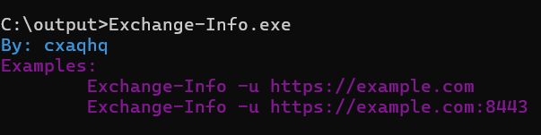
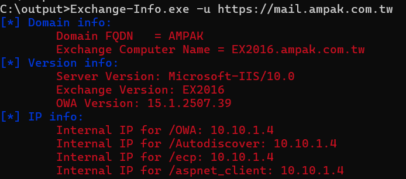

# Exchange-Info
Exchange 信息收集工具


## 使用方法（2025/01/03）
代码找到了，设置终端彩色输出  







## 更新日志
```
2025-01-03 v1.1
	[+] 设置终端测色输出
	
2024-07-23 v1.0
	[u] 第一步版本
```

### 参考项目
- https://github.com/Ridter/owa_info/  
- https://3gstudent.github.io/%E6%B8%97%E9%80%8F%E5%9F%BA%E7%A1%80-%E8%8E%B7%E5%BE%97Exchange%E6%9C%8D%E5%8A%A1%E5%99%A8%E7%9A%84%E5%86%85%E7%BD%91IP
